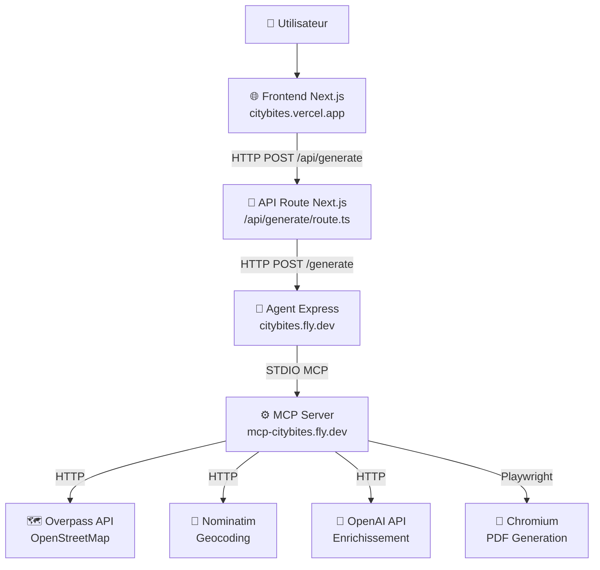

# Architecture CityBites - Schéma Complet

## 🎯 Vue d'ensemble

CityBites est une application de génération de guides gastronomiques avec architecture MCP (Model Context Protocol) distribuée sur 3 services.



## 📋 Services et URLs

| Service | URL Production | Port | Responsabilité |
|---------|---------------|------|----------------|
| **Frontend** | `https://citybites.vercel.app` | 3000 | Interface utilisateur, routage Next.js |
| **Agent** | `https://citybites.fly.dev` | 4000 | Orchestration MCP, validation, sécurité |
| **MCP Server** | `https://mcp-citybites.fly.dev` | 3001 | Outils métier (recherche, optimisation, PDF) |

## 🔄 Flux de Données Détaillé

### 1. Requête Utilisateur
```
[Utilisateur] 
    ↓ (Remplit formulaire)
[Frontend - Page principale]
    ↓ (Submit form)
[Frontend - API Route /api/generate]
```

### 2. Communication Frontend → Agent
```typescript
// apps/frontend/src/app/api/generate/route.ts
const AGENT_URL = process.env.AGENT_SERVICE_URL || "https://citybites.fly.dev"
fetch(`${AGENT_URL}/generate`, {
  method: "POST",
  body: JSON.stringify({ city, theme, day })
})
```

### 3. Communication Agent → MCP
```typescript
// apps/agent/src/generator.ts
// Communication STDIO avec MCP Server intégré dans le conteneur Fly.io
mcpClient.request({
  method: "tools/call",
  params: { name: "places_search", arguments: { city, query: theme } }
})
```

### 4. Services Externes (via MCP)
- **Overpass API**: Recherche de lieux OpenStreetMap
- **Nominatim**: Géocodage des adresses
- **OpenAI**: Enrichissement des descriptions
- **Playwright**: Génération PDF/HTML

## 📁 Structure des Applications

### Frontend (apps/frontend)
```
src/
├── app/
│   ├── page.tsx              # Page d'accueil avec navigation
│   ├── leaflet-test/         # Application principale avec carte
│   ├── test-simple/          # Version simplifiée
│   └── api/
│       └── generate/
│           └── route.ts      # Proxy vers Agent
└── components/               # Composants réutilisables
```

### Agent (apps/agent)
```
src/
├── server.ts                 # Serveur Express + sécurité
├── generator.ts              # Orchestration MCP
└── schemas.ts                # Validation Zod
```

### MCP Server (apps/mcp-citybites)
```
src/
├── mcp-server.ts             # Serveur MCP (STDIO)
├── server.ts                 # Serveur HTTP (debug only)
└── tools.ts                  # Outils métier
```

## 🔧 Variables d'Environnement

### Frontend
```bash
AGENT_SERVICE_URL=https://citybites.fly.dev
```

### Agent
```bash
PORT=4000
NODE_ENV=production
ALLOWED_ORIGINS=https://citybites.vercel.app
MCP_PREFIX=/app/apps/mcp-citybites  # Dans conteneur Fly.io
```

### MCP Server
```bash
PORT=3001
OPENAI_API_KEY=sk-...
OVERPASS_ENDPOINTS=https://overpass-api.de/api/interpreter
DISABLE_PDF=false
```

## 🚀 Endpoints Disponibles

### Frontend (citybites.vercel.app)
- `GET /` - Page d'accueil
- `GET /leaflet-test` - Application principale
- `GET /test-simple` - Version simple
- `POST /api/generate` - Proxy vers Agent

### Agent (citybites.fly.dev)
- `GET /health` - Status check
- `POST /generate` - Génération de guide

### MCP Server (mcp-citybites.fly.dev)
> ⚠️ Le MCP Server n'expose PAS d'endpoints HTTP en production.
> Il communique uniquement via STDIO avec l'Agent.

## 🔒 Sécurité

### Frontend
- Next.js security headers
- CORS géré par Agent
- Validation côté client + serveur

### Agent  
- Helmet.js (security headers)
- Rate limiting (60 req/15min)
- CORS restrictif en production
- Body size limit (200KB)
- Input validation avec Zod

### MCP Server
- Communication STDIO uniquement
- Pas d'exposition HTTP publique
- Timeout sur APIs externes

## 📊 Flux d'Erreurs

```
[Erreur MCP] → [Agent catches] → [HTTP 502] → [Frontend catches] → [Message utilisateur]
[Timeout Agent] → [Frontend AbortController] → [HTTP 504] → [Message timeout]
[Validation] → [HTTP 400] → [Details validation] → [Feedback formulaire]
```

## 🐛 Points de Debug

### 1. Frontend ne charge pas
- Vérifier: `https://citybites.vercel.app`
- Logs: Vercel Dashboard

### 2. API ne répond pas
- Vérifier: `https://citybites.fly.dev/health`
- Logs: `flyctl logs -a citybites`

### 3. MCP ne fonctionne pas
- L'Agent ne peut pas communiquer avec MCP
- Logs: `flyctl logs -a citybites` (même app)

## 🔍 Tests de Vérification

```bash
# 1. Frontend accessible
curl -I https://citybites.vercel.app
# Attendu: HTTP/2 200

# 2. Agent healthy
curl https://citybites.fly.dev/health
# Attendu: {"status":"ok"}

# 3. Test génération complete
curl -X POST https://citybites.vercel.app/api/generate \
  -H "Content-Type: application/json" \
  -d '{"city":"Paris","theme":"restaurant","day":"2025-09-25"}'
# Attendu: Guide généré ou erreur explicite
```

## ⚡ Déploiements

### GitHub Actions Workflow
1. **Tests** → Compilation + Lint de tous les apps
2. **Deploy Fly.io** → Agent (avec MCP embarqué) sur 2 régions
3. **Deploy Vercel** → Frontend avec variables d'environnement

### État Actuel
- ✅ Frontend: Déployé sur Vercel
- ✅ Agent: Déployé sur Fly.io CDG
- ✅ MCP: Embarqué dans Agent
- ❓ Communication: À vérifier

---

## 🚨 PROBLÈME IDENTIFIÉ

**Le MCP Server est déployé séparément sur `mcp-citybites.fly.dev` MAIS l'Agent essaie de communiquer en STDIO local.**

### Solution
L'Agent doit soit :
1. Communiquer avec MCP via STDIO dans le même conteneur
2. OU communiquer avec MCP via HTTP vers `mcp-citybites.fly.dev`

**Actuellement il y a confusion entre les deux approches.**