# 🎯 CityBites - Production Ready Report

## ✅ Repository Cleanup Complete

Le repository a été entièrement nettoyé pour **ne conserver que l'environnement de production**.

---

## 🗑️ Éléments Supprimés

### Pages de Test Frontend
- ❌ `apps/frontend/src/app/leaflet-test/` - Page de test carte Leaflet
- ❌ `apps/frontend/src/app/test-api/` - Page de test API
- ❌ `apps/frontend/src/app/test-simple/` - Page de test simple

### Scripts de Développement
- ❌ `scripts/run-tests.sh` - Script de tests Linux/macOS
- ❌ `scripts/run-tests.ps1` - Script de tests Windows
- ❌ `scripts/push-prod.sh` - Script de déploiement
- ❌ `scripts/` - Dossier complet supprimé

### Documentation de Debug
- ❌ `DEBUG-404-RESOLUTION.md` - Rapport de débogage 404
- ❌ `rapport-communications.md` - Rapport de communications
- ❌ `FINAL-CODE-REVIEW-REPORT.md` - Rapport de revue de code
- ❌ `AGENTS.md` - Guidelines agents (obsolète)

### Serveurs de Debug
- ❌ `apps/mcp-citybites/src/server.ts` - Serveur HTTP debug MCP
- ❌ `apps/mcp-citybites/.env.example` - Fichier d'exemple

### Scripts Package.json
- ❌ Scripts `dev` supprimés de tous les packages
- ❌ Scripts `test` supprimés 
- ❌ Références `localhost` supprimées

---

## ✅ Structure Finale Simplifiée

### 📁 Arborescence Produit
```
citybites/
├── apps/
│   ├── frontend/          # Next.js - Interface utilisateur
│   ├── agent/             # Express - Orchestration MCP
│   └── mcp-citybites/     # MCP Server - Outils métier
├── .github/workflows/     # CI/CD automatisé
├── ARCHITECTURE.md        # Documentation architecture
├── WARP.md               # Guidelines production
└── README.md             # Instructions setup
```

### 🚀 Applications Finales

#### Frontend (`apps/frontend`)
- **Page unique** : `/` avec recherche intégrée
- **API Route** : `/api/generate` → Agent
- **Scripts** : `build`, `start` uniquement
- **UI** : Recherche + Carte Leaflet + Résultats

#### Agent (`apps/agent`) 
- **Serveur Express** avec sécurité complète
- **Communication MCP** via STDIO
- **Scripts** : `build`, `start` uniquement
- **Sécurité** : Helmet, Rate Limiting, CORS

#### MCP Server (`apps/mcp-citybites`)
- **Protocole MCP uniquement** (pas d'HTTP)
- **Outils** : Overpass, OpenAI, PDF, Géocodage
- **Scripts** : `build`, `mcp` uniquement

---

## 🔗 URLs de Production

| Service | URL | Description |
|---------|-----|-------------|
| **Frontend** | `https://citybites.vercel.app` | Interface utilisateur |
| **Agent API** | `https://citybites.fly.dev` | Orchestration backend |
| **MCP Server** | *(STDIO uniquement)* | Outils métier intégrés |

---

## 📊 Workflow de Production

```mermaid
graph LR
    User[👤 Utilisateur] --> FE[🌐 Frontend Vercel]
    FE --> |/api/generate| Agent[🤖 Agent Fly.io]
    Agent --> |STDIO| MCP[⚙️ MCP Server]
    MCP --> |API| External[🌍 Services Externes]
```



### Flux de Données
1. **Utilisateur** → Formulaire de recherche
2. **Frontend** → API Route Next.js → Agent Fly.io
3. **Agent** → Communication MCP STDIO → Outils métier
4. **MCP** → APIs externes (Overpass, OpenAI, etc.)
5. **Retour** → Guide généré avec carte interactive

---

## ✅ État des Builds

- ✅ **Frontend** : `npm run build` ✅ Succès
- ✅ **Agent** : `npm run build` ✅ Succès  
- ✅ **MCP Server** : `npm run build` ✅ Succès

---

## 🔧 Variables d'Environnement Requis

### Vercel (Frontend)
```bash
AGENT_SERVICE_URL=https://citybites.fly.dev
```

### Fly.io (Agent + MCP)
```bash
NODE_ENV=production
ALLOWED_ORIGINS=https://citybites.vercel.app
PORT=4000
OPENAI_API_KEY=sk-...
```

---

## 🎉 Résultat Final

**Repository 100% Production** :
- ✅ **0 mock** ou environnement de test
- ✅ **0 script de développement** 
- ✅ **0 page de debug**
- ✅ **Interface unique** optimisée
- ✅ **Builds propres** TypeScript
- ✅ **Déploiement automatique** GitHub Actions
- ✅ **Sécurité complète** en production

**Gains :**
- 📉 **1672 lignes supprimées** / 230 ajoutées
- ⚡ **19 fichiers supprimés**
- 🧹 **Architecture simplifiée** 
- 🚀 **Prêt pour la production**

---

## 📝 Prochaines Actions

1. **Tester l'application** : https://citybites.vercel.app
2. **Monitorer les déploiements** : GitHub Actions  
3. **Optimisations futures** : Cache LRU, observabilité

*Commit: `66fb03d` - "refactor: clean repository for production-only environment"*